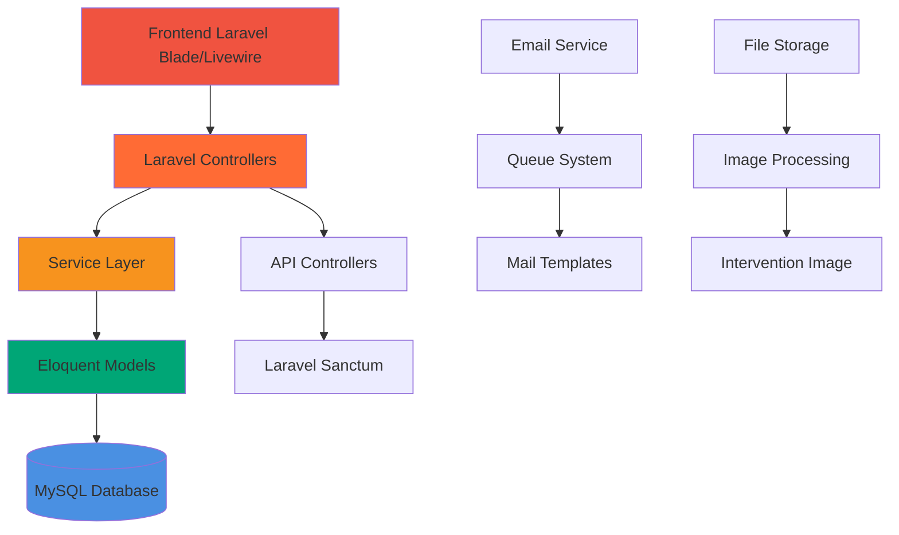

# 🚀 SERVISPIN - Appointment Management System

[](https://laravel.com/)
[](https://php.net/)
[](https://mysql.com/)
[](https://tailwindcss.com/)
[](https://laravel-livewire.com/)
[](https://opensource.org/licenses/MIT)

A comprehensive **Appointment Management System** built with Laravel for technical service businesses. Streamline customer appointments, manage availability schedules, handle service bookings, and maintain complete business operations through an intuitive web interface.

## 📋 Table of Contents

-   [✨ Features](#-features)
-   [🚀 Demo](#-demo)
-   [🏗️ Architecture](#️-architecture)
-   [🛠️ Technologies](#️-technologies)
-   [📁 Project Structure](#-project-structure)
-   [⚡ Quick Start](#-quick-start)
-   [📖 API Documentation](#-api-documentation)
-   [🧪 Testing](#-testing)
-   [🚀 Deployment](#-deployment)
-   [🤝 Contributing](#-contributing)
-   [📝 License](#-license)
-   [👥 Authors](#-authors)

## ✨ Features

### 🎯 Complete Appointment Management

-   **Full Lifecycle Management**: Handle appointments from creation to completion
-   **Real-time Status Updates**: Track appointment states (New, Pending, Confirmed, Cancelled, Completed)
-   **Customer Information**: Complete client data management with contact details
-   **Service Integration**: Link appointments to specific services and brands
-   **Photo Upload**: Optional equipment photos for service documentation

### 🔧 Advanced Availability System

-   **Flexible Scheduling**: Configure availability rules by day of the week
-   **Exception Management**: Handle holidays, special closures, and temporary changes
-   **Time Zone Support**: Proper timezone handling for global operations
-   **Slot Calculation**: Dynamic available time slot generation

### 👥 User Management & Authentication

-   **Multi-role System**: Admin, staff, and customer roles with granular permissions
-   **Social Authentication**: Google OAuth integration
-   **Two-Factor Authentication**: Enhanced security with 2FA
-   **Profile Management**: User profiles with photo upload capabilities

### 📧 Automated Communication

-   **Email Notifications**: Automated emails for all appointment lifecycle events
-   **Confirmation Emails**: Instant booking confirmations for customers
-   **Reminder System**: Configurable appointment reminders
-   **Status Updates**: Real-time notifications for appointment changes

### 🛠️ Technical Excellence

-   **RESTful API**: Complete API for mobile apps and third-party integrations
-   **Rate Limiting**: Protection against API abuse
-   **Transaction Management**: ACID-compliant database operations
-   **Image Processing**: Automatic image optimization and storage
-   **Caching System**: Performance optimization with intelligent caching

## 🚀 Demo

### Screenshots

#### Customer Booking Interface


#### Admin Dashboard


#### Appointment Management


> 📸 _Screenshots will be updated with actual project images_

### Development URLs

-   **Main Application**: http://localhost:8000
-   **API Documentation**: http://localhost:8000/api/documentation
-   **Admin Panel**: http://localhost:8000/admin

## 🏗️ Architecture



### System Architecture

```
servispin/
├── app/                          # 🖥️  Laravel Application Core
│   ├── Actions/                  # 🎯 Jetstream specific actions
│   ├── Console/                  # ⚡ Artisan commands
│   ├── Exceptions/               # 🚨 Custom exception handlers
│   ├── Helpers/                  # 🛠️  Shared utilities (ImageHelper)
│   ├── Http/
│   │   ├── Controllers/          # 🎮 Web and API controllers
│   │   ├── Livewire/             # ⚡ Livewire SPA components
│   │   └── Middleware/           # 🛡️  Custom middleware
│   ├── Mail/                     # 📧 Email templates
│   ├── Models/                   # 📊 Eloquent models with relationships
│   ├── Providers/                # 🔧 Service providers
│   ├── Services/                 # 🏢 Business logic services
│   └── Traits/                   # 🔄 Reusable traits
├── database/
│   ├── factories/                # 🏭 Model factories
│   ├── migrations/               # 🗃️  Database migrations
│   └── seeders/                  # 🌱 Database seeders
├── public/                       # 🌐 Public assets
├── resources/
│   ├── css/                      # 🎨 Stylesheets
│   ├── js/                       # 📜 JavaScript files
│   ├── views/                    # 📄 Blade templates
│   └── markdown/                 # 📝 Documentation
├── routes/                       # 🛣️  Route definitions
├── tests/                        # 🧪 Test suites
└── README.md                     # 📖 Documentation
```

## 🛠️ Technologies

### Backend Stack

-   **[Laravel Framework](https://laravel.com/)** (10.x) - PHP web framework
-   **[PHP](https://php.net/)** (8.1+) - Server-side scripting
-   **[MySQL](https://mysql.com/)** (8.0+) - Relational database
-   **[Redis](https://redis.io/)** - Caching and sessions (optional)

### Frontend Stack

-   **[Tailwind CSS](https://tailwindcss.com/)** (3.x) - Utility-first CSS framework
-   **[Livewire](https://laravel-livewire.com/)** (3.x) - Dynamic components
-   **[Alpine.js](https://alpinejs.dev/)** - Lightweight reactivity
-   **[Vite](https://vitejs.dev/)** - Modern build tool

### External Libraries

-   **[Spatie Laravel Permission](https://spatie.be/docs/laravel-permission)** - Roles and permissions
-   **[Laravel Jetstream](https://jetstream.laravel.com/)** - Admin panel scaffolding
-   **[Laravel Socialite](https://laravel.com/docs/socialite)** - Social authentication
-   **[Intervention Image](https://image.intervention.io/)** - Image processing
-   **[Carbon](https://carbon.nesbot.com/)** - Date/time manipulation

### DevOps & Quality

-   **Docker & Docker Compose** - Containerization
-   **Laravel Sail** - Development environment
-   **Composer** - PHP dependency management
-   **NPM** - Node.js dependency management
-   **PHPUnit** - Testing framework

## 📁 Project Structure

### Core Application (`app/`)

```
app/
├── Actions/
│   └── Fortify/                  # 🔐 Authentication actions
├── Console/
│   ├── Commands/                 # ⚡ Custom Artisan commands
│   └── Kernel.php               # 🎯 Command scheduler
├── Exceptions/
│   └── Handler.php              # 🚨 Exception handling
├── Helpers/
│   └── ImageHelper.php          # 🖼️  Image processing utilities
├── Http/
│   ├── Controllers/             # 🎮 HTTP controllers
│   │   ├── AppointmentController.php
│   │   ├── AvailabilityController.php
│   │   └── ...
│   ├── Livewire/                # ⚡ Livewire components
│   │   ├── UsersCrud.php        # 👥 User management
│   │   └── PostComponent.php    # 📝 Blog posts
│   └── Middleware/              # 🛡️  Custom middleware
├── Mail/                        # 📧 Email classes
│   ├── AppointmentConfirmation.php
│   ├── AppointmentReminder.php
│   └── ...
├── Models/                      # 📊 Eloquent models
│   ├── User.php
│   ├── Appointment.php
│   ├── Service.php
│   ├── Brand.php
│   ├── AvailabilityRule.php
│   └── ...
├── Providers/                   # 🔧 Service providers
├── Services/                    # 🏢 Business services
│   └── TransactionService.php   # 🔄 Transaction management
└── Traits/                      # 🔄 Reusable traits
    ├── CacheTrait.php           # 💾 Caching functionality
    └── ChecksPermissions.php    # 🛡️  Permission checks
```

### Database Structure

```
database/
├── factories/                   # 🏭 Model factories
│   └── UserFactory.php
├── migrations/                  # 🗃️  Database schema
│   ├── 2024_01_01_000001_create_users_table.php
│   ├── 2024_01_01_000002_create_services_table.php
│   ├── 2024_01_01_000003_create_appointments_table.php
│   └── ...
└── seeders/                     # 🌱 Data seeding
    ├── DatabaseSeeder.php
    └── ServiceSeeder.php
```

## ⚡ Quick Start

### Prerequisites

-   **PHP** 8.1+ ([Download](https://php.net/))
-   **Composer** ([Installation](https://getcomposer.org/))
-   **Node.js** 16+ & **NPM** ([Download](https://nodejs.org/))
-   **MySQL** 8.0+ or **PostgreSQL**
-   **Git** ([Download](https://git-scm.com/))

### Installation

1. **Clone the repository**

    ```bash
    git clone https://github.com/your-username/servispin.git
    cd servispin
    ```

2. **Install PHP dependencies**

    ```bash
    composer install
    ```

3. **Install Node.js dependencies**

    ```bash
    npm install
    ```

4. **Environment configuration**

    ```bash
    cp .env.example .env
    php artisan key:generate
    ```

    Configure your `.env` file with database credentials and other settings.

5. **Database setup**

    ```bash
    php artisan migrate
    php artisan db:seed
    ```

6. **Build assets**

    ```bash
    npm run build
    # or for development
    npm run dev
    ```

7. **Start the application**

    ```bash
    php artisan serve
    ```

    The application will be available at: http://localhost:8000

### Verification

-   Visit http://localhost:8000 to see the main application
-   Access admin panel at http://localhost:8000/admin
-   API endpoints available at http://localhost:8000/api/

## 📖 API Documentation

### Base URL

```
http://localhost:8000/api
```

### Authentication

All admin endpoints require authentication via Laravel Sanctum:

```bash
# Get authentication token
POST /api/login
Content-Type: application/json

{
  "email": "admin@example.com",
  "password": "password"
}
```

### Appointment Management Endpoints

#### 📅 Customer Endpoints

```http
GET    /api/appointments/book              # Booking form data
GET    /api/appointments/services          # Available services
POST   /api/appointments/store             # Create new appointment
POST   /api/appointments/availability/slots # Available time slots
```

#### 🛠️ Admin Endpoints (Protected)

```http
GET    /api/admin/appointments             # List appointments (paginated)
GET    /api/admin/appointments/{id}        # Get appointment details
PUT    /api/admin/appointments/{id}        # Update appointment
DELETE /api/admin/appointments/{id}        # Delete appointment
PATCH  /api/admin/appointments/{id}/confirm # Confirm appointment
PATCH  /api/admin/appointments/{id}/cancel  # Cancel appointment
PATCH  /api/admin/appointments/{id}/complete # Complete appointment
```

#### 📅 Availability Management

```http
GET    /api/admin/availability/rules              # Get availability rules
POST   /api/admin/availability/rules              # Create/update rule
GET    /api/admin/availability/exceptions         # Get exceptions
POST   /api/admin/availability/exceptions         # Create/update exception
DELETE /api/admin/availability/exceptions/{id}    # Delete exception
```

### Response Format

All API responses follow a consistent JSON structure:

```json
{
  "success": true,
  "data": { ... },
  "message": "Operation completed successfully",
  "timestamp": "2024-01-01T12:00:00.000Z"
}
```

### Error Handling

Error responses include detailed information:

```json
{
    "success": false,
    "error": {
        "code": "VALIDATION_ERROR",
        "message": "The given data was invalid.",
        "details": {
            "email": ["The email field is required."]
        }
    },
    "timestamp": "2024-01-01T12:00:00.000Z"
}
```

## 🧪 Testing

### Running Tests

```bash
# Run all tests
php artisan test

# Run with coverage
php artisan test --coverage

# Run specific test suite
php artisan test tests/Feature/AppointmentTest.php
```

### Test Structure

```
tests/
├── Feature/                    # 🧪 Integration tests
│   ├── AppointmentTest.php     # 📅 Appointment functionality
│   ├── AvailabilityTest.php    # 📆 Availability system
│   └── AuthenticationTest.php  # 🔐 Auth system
├── Unit/                       # 🧪 Unit tests
│   ├── Services/              # 🏢 Service layer tests
│   └── Models/                # 📊 Model tests
└── TestCase.php               # 🏗️ Base test class
```

### Testing Coverage

-   **API Endpoints**: Critical business endpoints
-   **Models & Relationships**: Data integrity and relationships
-   **Services**: Business logic validation
-   **Authentication**: Security and authorization
-   **Validation**: Input validation and sanitization

## 🚀 Deployment

### Production Environment

#### Manual Deployment

1. **Server Requirements**

    - PHP 8.1+ with required extensions
    - MySQL 8.0+ or PostgreSQL
    - Redis (recommended)
    - Nginx or Apache

2. **Deployment Steps**

    ```bash
    # Clone repository
    git clone https://github.com/your-username/servispin.git
    cd servispin

    # Install dependencies
    composer install --optimize-autoloader --no-dev
    npm install && npm run build

    # Environment setup
    cp .env.example .env
    php artisan key:generate
    php artisan config:cache
    php artisan route:cache
    php artisan view:cache

    # Database migration
    php artisan migrate --force
    php artisan db:seed --force

    # Storage setup
    php artisan storage:link
    ```

#### Nginx Configuration

```nginx
server {
    listen 80;
    server_name your-domain.com;
    root /path/to/servispin/public;
    index index.php;

    location / {
        try_files $uri $uri/ /index.php?$query_string;
    }

    location ~ \.php$ {
        include fastcgi_params;
        fastcgi_pass unix:/var/run/php/php8.1-fpm.sock;
        fastcgi_param SCRIPT_FILENAME $document_root$fastcgi_script_name;
    }

    location ~* \.(js|css|png|jpg|jpeg|gif|ico|svg)$ {
        expires 1y;
        add_header Cache-Control "public, immutable";
    }
}
```

#### Docker Deployment

```dockerfile
# Dockerfile
FROM php:8.1-fpm-alpine

# Install system dependencies
RUN apk add --no-cache \
    nginx \
    mysql-client \
    redis

# Install PHP extensions
RUN docker-php-ext-install pdo pdo_mysql

# Copy application
COPY . /var/www/html
WORKDIR /var/www/html

# Install Composer dependencies
RUN composer install --optimize-autoloader --no-dev

# Setup permissions
RUN chown -R www-data:www-data /var/www/html/storage /var/www/html/bootstrap/cache

EXPOSE 80
CMD ["php", "artisan", "serve", "--host=0.0.0.0", "--port=80"]
```

### Environment Variables

```bash
# Application
APP_NAME="SERVISPIN"
APP_ENV=production
APP_KEY=base64:your-generated-key
APP_DEBUG=false
APP_URL=https://your-domain.com

# Database
DB_CONNECTION=mysql
DB_HOST=127.0.0.1
DB_PORT=3306
DB_DATABASE=servispin
DB_USERNAME=your_db_user
DB_PASSWORD=your_db_password

# Mail Configuration
MAIL_MAILER=smtp
MAIL_HOST=your-smtp-host
MAIL_PORT=587
MAIL_USERNAME=your-email@domain.com
MAIL_PASSWORD=your-email-password

# Cache & Sessions
CACHE_DRIVER=redis
SESSION_DRIVER=redis
REDIS_HOST=127.0.0.1
REDIS_PASSWORD=null
REDIS_PORT=6379
```

## 🤝 Contributing

¡Contributions are welcome! 🎉

### Development Guidelines

1. **Fork** the project
2. Create a feature branch (`git checkout -b feature/AmazingFeature`)
3. **Commit** your changes (`git commit -m 'Add some AmazingFeature'`)
4. **Push** to the branch (`git push origin feature/AmazingFeature`)
5. Open a **Pull Request**

### Code Standards

-   Follow **PSR-12** coding standards
-   Use **Laravel conventions** for naming
-   Write **comprehensive tests** for new features
-   Update documentation for API changes

### Commit Convention

```
feat: add new appointment booking feature
fix: resolve timezone issue in availability slots
docs: update API documentation
style: format code with PSR standards
refactor: optimize database queries
test: add unit tests for service layer
```

## 📝 License

This project is licensed under the MIT License - see the [LICENSE](LICENSE) file for details.

## 👥 Authors

-   **Your Name** - _Initial Development_ - [GitHub](https://github.com/your-username)

### Acknowledgments

-   [Laravel](https://laravel.com/) for the excellent PHP framework
-   [Tailwind CSS](https://tailwindcss.com/) for the utility-first CSS framework
-   [Livewire](https://laravel-livewire.com/) for dynamic components
-   [Spatie](https://spatie.be/) for amazing Laravel packages
-   [Intervention Image](https://image.intervention.io/) for image processing

---

<div align="center">

**Built with ❤️ and lots of ☕**

⭐ If you like this project, give it a star!

[⬆ Back to top](#-servispin---appointment-management-system)

</div>
