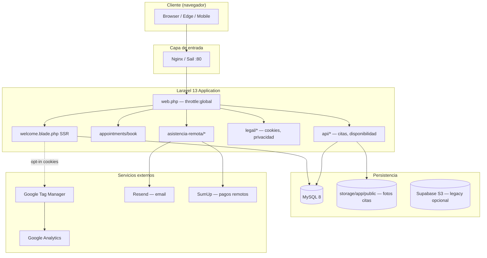
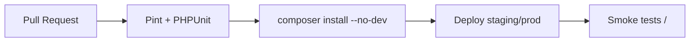

# SERVISPIN — Public Landing & Marketing Surface

[](https://laravel.com)
[](https://php.net)
[-38B2AC?logo=tailwindcss&logoColor=white)](https://tailwindcss.com)
[](../../LICENSE)
[](../../tests)
[](https://www.w3.org/WAI/WCAG22/quickref/)

> **Nota de arquitectura:** La landing pública de SERVISPIN **no está construida con Astro**. Es una vista **server-rendered** (`welcome.blade.php`) servida por **Laravel 13** con Tailwind CSS v4 (browser build), assets estáticos y JavaScript vanilla/Alpine en el panel admin. Este documento describe la superficie de marketing y captación tal como existe en producción/desarrollo.

**Propósito:** Landing de captación para servicio técnico de electrodomésticos en Gran Canaria — reparación a domicilio, reserva de citas, contacto, galería, blog y promoción de **asistencia técnica remota** por videollamada.

**Audiencia:** Desarrolladores senior, arquitectos, DevOps y equipos de producto que operan o extienden la web pública.

**Industria:** Servicios técnicos / reparación de electrodomésticos (B2C local + asistencia remota internacional).


---

## Tabla de contenidos

- [Resumen ejecutivo](#resumen-ejecutivo)
- [Arquitectura](#arquitectura)
- [Stack tecnológico](#stack-tecnológico)
- [Estructura del proyecto (landing)](#estructura-del-proyecto-landing)
- [Prerrequisitos](#prerrequisitos)
- [Instalación por entorno](#instalación-por-entorno)
- [Variables de entorno](#variables-de-entorno)
- [Comandos CLI](#comandos-cli)
- [Componentes y diseño](#componentes-y-diseño)
- [SEO técnico](#seo-técnico)
- [Performance y Core Web Vitals](#performance-y-core-web-vitals)
- [Seguridad](#seguridad)
- [Testing](#testing)
- [CI/CD y despliegue](#cicd-y-despliegue)
- [Observabilidad](#observabilidad)
- [Contribución](#contribución)
- [Roadmap](#roadmap)
- [Alternativas consideradas](#alternativas-consideradas)

---

## Resumen ejecutivo

| Dimensión | Decisión actual |
|-----------|-----------------|
| **Rendering** | SSR (Laravel Blade → HTML en cada request) |
| **Ruta principal** | `GET /` → `welcome` view |
| **Conversión** | Citas presenciales, WhatsApp, teléfono, asistencia remota |
| **CMS ligero** | Posts (Livewire), galería (CRUD admin) |
| **Compliance** | Banner cookies GDPR opt-in antes de GTM/GA |

**KPIs de negocio enlazados:** reservas (`/appointments/book`), funnel remoto (`/asistencia-remota`), leads WhatsApp/teléfono.

---

## Arquitectura

### Diagrama de alto nivel



### Estrategia de rendering

| Superficie | Estrategia | Justificación |
|------------|------------|---------------|
| `/` (landing) | **SSR** | Contenido dinámico (`CompanyData`, `GalleryImage`), SEO inmediato, sin build step para la home |
| `/appointments/book` | **SSR** | Formularios con CSRF, validación server-side |
| `/asistencia-remota/*` | **SSR** | Mismo stack; funnel de pago y slots vía API interna |
| Admin (`/dashboard`, CRUD) | **SSR + Livewire** | Interactividad sin SPA completa |
| Assets estáticos | **CDN browser + `/public`** | Tailwind v4 Play CDN en landing; CSS legacy en `/files` |

> **SSG / ISR / Astro:** No aplican a la landing actual. Una migración futura a Astro SSG sería viable para secciones estáticas (hero, servicios, testimonios) manteniendo Laravel para formularios y API — ver [Alternativas consideradas](#alternativas-consideradas).

### Patrones de diseño

| Patrón | Uso en landing |
|--------|----------------|
| **MVC** | `Route` → closure/controller → `welcome` view |
| **Repository implícito** | Eloquent (`GalleryImage`, `CompanyData`) |
| **Middleware pipeline** | `throttle:global`, CSRF en formularios |
| **Progressive enhancement** | Video hero con fallback gradient; menú móvil sin framework |
| **Privacy by design** | Analytics solo tras consentimiento (`servispin_cookie_consent`) |

### Performance budgets (objetivos)

| Métrica | Budget objetivo | Notas |
|---------|-----------------|-------|
| **LCP** | < 2.5 s | Video hero puede penalizar; `display:none` en móvil |
| **INP** | < 200 ms | JS mínimo en landing |
| **CLS** | < 0.1 | Reservar altura en imágenes/logo |
| **TTFB** | < 600 ms | Depende de PHP/MySQL en servidor |
| **Peso inicial HTML** | < 150 KB | Monitorear crecimiento de `welcome.blade.php` |

<details>
<summary>Lighthouse — estado y cómo medir</summary>

No hay scores versionados en el repositorio. Ejecutar localmente:

```bash
# Desarrollo local (Sail en http://localhost)
npx lighthouse http://localhost --only-categories=performance,accessibility,seo,best-practices --view

# Producción
npx lighthouse https://servispin.net --only-categories=performance,accessibility,seo,best-practices --view
```

Factores que afectan el score actual:

- Tailwind v4 vía CDN (request adicional)
- Video de fondo en hero (desktop)
- Scripts de terceros (GTM/GA) solo tras opt-in
- jQuery + Slick + Magnific Popup (legacy)

</details>

---

## Stack tecnológico

| Capa | Tecnología | Versión | Justificación |
|------|------------|---------|---------------|
| Runtime | PHP | 8.4+ | Requisito Laravel 13 |
| Framework | Laravel | 13.x | SSR, auth, API, colas, ecosistema maduro |
| DB | MySQL | 8.0+ | Datos de empresa, galería, citas |
| CSS (landing) | Tailwind CSS | 4.x browser | Iteración rápida sin rebuild en home |
| CSS (admin) | Tailwind CSS | 3.x + Vite | Build para panel y Livewire |
| Tipografía | Plus Jakarta Sans | Google Fonts | Legibilidad UI/marketing |
| JS (landing) | Vanilla + jQuery | 3.7 | Legacy sliders/lightbox |
| JS (admin) | Alpine.js | 3.x | Sidebar, tema, modales |
| Contenedores | Laravel Sail | Docker | Paridad dev/prod local |
| Email | Resend | Laravel driver | Transaccional citas/remoto |
| SEO lib | artesaos/seotools | 1.4 | Meta tags en otras vistas |
| Imágenes | Intervention Image | 4.x | Resize fotos citas |

---

## Estructura del proyecto (landing)

```
SERVISPIN/
├── public/
│   ├── files/              # Assets legacy landing (css, js, images, video-hero.mp4)
│   ├── img/favicon/        # PWA manifest + favicons
│   └── storage →           # Symlink requerido: storage/app/public
├── resources/views/
│   ├── welcome.blade.php   # ★ Landing principal (hero, servicios, testimonios, contacto)
│   ├── appointments/       # Flujo reserva presencial
│   ├── remote-assistance/  # Funnel asistencia remota
│   └── legal/              # Cookies, privacidad, términos
├── routes/web.php          # GET /, rutas públicas throttled
├── app/Http/Controllers/
│   ├── Api/AppointmentController.php
│   └── Api/RemoteAssistanceController.php
└── docs/landing/README.md  # Este documento
```

### Flujo de la home (`welcome.blade.php`)

1. **Banner fijo** — promoción asistencia remota (siempre visible)
2. **Navbar sticky** — anclas + CTA citas + enlace remoto
3. **Hero** — video/gradient, CTAs (WhatsApp, cita, videollamada, teléfono)
4. **Servicios** — grid bento
5. **Galería** — datos desde `GalleryImage`
6. **Testimonios / contacto / footer**
7. **Popup remoto** — una vez por visitante (`localStorage`)
8. **Banner cookies** — GDPR opt-in

---

## Prerrequisitos

| Herramienta | Versión mínima | Verificación |
|-------------|----------------|--------------|
| Docker Desktop | 4.x | `docker --version` |
| Composer | 2.7+ | `composer --version` |
| Node.js (admin assets) | 18+ | `node --version` |
| Git | 2.40+ | `git --version` |

**Recursos recomendados (Sail):** 4 GB RAM, 2 vCPU.

---

## Instalación por entorno

### Desarrollo (Sail)

```bash
git clone <repo-url> servispin && cd servispin
cp .env.example .env
composer install
./vendor/bin/sail up -d
./vendor/bin/sail artisan key:generate
./vendor/bin/sail artisan migrate --seed
./vendor/bin/sail artisan storage:link   # ★ Crítico para fotos /storage/*
```

**Salida esperada `storage:link`:**

```
The [public/storage] link has been connected to [storage/app/public].
```

Abrir en desarrollo: `http://localhost` · Producción: [https://servispin.net](https://servispin.net)

### Staging / Producción

```bash
composer install --no-dev --optimize-autoloader
php artisan config:cache
php artisan route:cache
php artisan view:cache
php artisan migrate --force
php artisan storage:link
# Reiniciar PHP-FPM / workers
```

<details>
<summary>Nginx — fragmento recomendado</summary>

```nginx
root /var/www/servispin/public;
index index.php;

location / {
    try_files $uri $uri/ /index.php?$query_string;
}

location ~ \.php$ {
    fastcgi_pass unix:/var/run/php/php8.4-fpm.sock;
    fastcgi_param SCRIPT_FILENAME $document_root$fastcgi_script_name;
    include fastcgi_params;
}
```

</details>

---

## Variables de entorno

| Variable | Requerida | Descripción | Ejemplo |
|----------|-----------|-------------|---------|
| `APP_URL` | Sí | URL base (afecta `Storage::url`) | `https://servispin.net` |
| `APP_ENV` | Sí | `local` / `staging` / `production` | `production` |
| `DB_*` | Sí | Conexión MySQL | ver `.env.example` |
| `MAIL_*` / Resend | Sí (citas) | Email transaccional | `RESEND_API_KEY=re_...` |
| `FILESYSTEM_DISK` | No | Disco por defecto | `local` |
| `AWS_*` | No | Supabase legacy / S3 | endpoint Supabase |

Las claves de **Google Analytics / GTM** están embebidas en `welcome.blade.php` y solo cargan tras consentimiento de cookies.

---

## Comandos CLI

```bash
# Desarrollo
./vendor/bin/sail up -d
./vendor/bin/sail artisan serve   # alternativa sin Docker

# Tests (incluye módulo remoto)
./vendor/bin/sail artisan test
./vendor/bin/sail artisan test --filter=BookingTest

# Calidad de código
./vendor/bin/sail pint

# Cache (producción)
php artisan optimize
```

---

## Componentes y diseño

### Sistema visual

| Token / patrón | Valor |
|------------------|-------|
| Fuente | `Plus Jakarta Sans` |
| Primario | Cyan/blue gradient (`#0ea5e9` → `#1e40af`) |
| Remoto | Violet (`#6d28d9`, `#7c3aed`) |
| Efectos | `glass-effect`, `mesh-gradient`, `gradient-bg` |
| CTAs hero | `.hero-cta-btn` — compactos, grid 2×2 / 4 cols |

### Assets

| Tipo | Ubicación | Optimización |
|------|-----------|--------------|
| Logo / imágenes marketing | `public/files/images/` | WebP donde aplica |
| Video hero | `public/files/images/video-hero.mp4` | Oculto en `<768px` |
| Fotos citas | `storage/app/public/appointment_photos/` | Intervention resize 1200px JPEG 85% |
| Favicon | `public/img/favicon/` | Manifest PWA |

---

## SEO técnico

| Implementación | Estado |
|----------------|--------|
| `<title>` descriptivo | ✅ `welcome.blade.php` |
| Meta description / keywords | ✅ Básico en `<head>` |
| `robots` landing remota | `noindex` en funnel remoto (intencional) |
| Canonical | ⚠️ Revisar por ruta |
| Sitemap XML | ⚠️ No versionado en repo |
| Open Graph / Twitter Cards | ⚠️ Mejora pendiente |
| Schema.org LocalBusiness | ⚠️ Mejora pendiente |
| Core Web Vitals | 📊 Medir con Lighthouse |

**Enlaces internos clave:** `/appointments/book`, `/asistencia-remota`, `/legal/cookies`.

---

## Performance y optimización

### Implementado

- Video hero deshabilitado en móvil (ahorro ancho de banda)
- `loading="lazy"` en imágenes del popup remoto
- Throttle global en rutas web
- Consentimiento antes de scripts de analítica
- Imágenes de citas redimensionadas server-side

### Pendiente / recomendado

- [ ] Self-host Tailwind build para landing (eliminar CDN)
- [ ] `preload` fuente crítica con `font-display: swap`
- [ ] Migrar sliders a CSS/native o bundle único
- [ ] HTTP cache headers para `/files/**` (ver `README.md` raíz nginx)
- [ ] Bundle analysis Vite solo afecta admin, no landing

<details>
<summary>Lazy loading y code splitting</summary>

La landing **no usa** bundler JS propio: scripts cargados de forma síncrona/defer desde CDN y `/files/js`. El code splitting aplica al panel admin vía Vite (`npm run build`).

</details>

---

## Seguridad

| Control | Implementación |
|---------|----------------|
| CSRF | Token en meta + formularios/API web |
| Rate limiting | `throttle:global`, `throttle:appointments` |
| `.env` / secrets | Fuera de `public/`; bloqueo en `.htaccess` |
| Cookies analítica | Opt-in GDPR |
| Headers seguridad | Configurar en Nginx (HSTS, X-Frame-Options) |
| Dependencias | `composer audit` periódico |

```bash
composer audit
```

---

## Testing

| Capa | Herramienta | Cobertura landing-adjacent |
|------|-------------|----------------------------|
| Unit | PHPUnit 12 | Modelos, helpers imagen |
| Feature | PHPUnit | `RemoteAssistance/*`, citas API |
| E2E | — | No configurado (recomendado: Playwright) |
| A11y | — | Recomendado: axe en CI |

```bash
./vendor/bin/sail artisan test --filter=RemoteAssistance
```

---

## CI/CD y despliegue

> **Estado actual:** No hay workflows en `.github/workflows/`. Recomendación documentada.

### Pipeline propuesto



| Estrategia | Uso recomendado |
|------------|-----------------|
| **Rolling** | VPS único / Sail producción |
| **Blue-green** | Cuando haya dos instancias detrás de LB |
| **Canary** | Tráfico gradual tras migraciones grandes |

### Git workflow sugerido

**Trunk-based** con ramas cortas `feature/*` → PR → `main` → deploy.

### Conventional Commits

```
feat(landing): add remote assistance banner
fix(storage): ensure public disk symlink in deploy docs
docs(landing): enterprise README
```

---

## Observabilidad

| Señal | Herramienta |
|-------|-------------|
| Errores PHP | Laravel Log / Spatie Ignition (dev) |
| Tráfico marketing | GTM + GA (post-consent) |
| Uptime | Externo (UptimeRobot, etc.) |
| APM | No configurado — recomendado Laravel Nightwatch o Sentry |

---

## Contribución

1. Fork → rama `feature/<ticket>-descripcion`
2. `./vendor/bin/sail artisan test`
3. `./vendor/bin/sail pint`
4. PR con descripción, screenshots si afecta UI
5. Review por al menos 1 senior

**Estilo:** Laravel Pint (PSR-12). **Blade:** componentes reutilizables; evitar duplicar CSS inline en nuevas secciones.

---

## Roadmap

| Prioridad | Item |
|-----------|------|
| P1 | OG tags + JSON-LD LocalBusiness en home |
| P1 | CI PHPUnit en GitHub Actions |
| P2 | Evaluar Astro/SSG para secciones estáticas |
| P2 | Playwright smoke: home + book + remoto |
| P3 | i18n ES/EN si expansión fuera de ES |
| P3 | Métricas carbono hosting (Green Web Foundation) |

### Changelog

Ver commits en `main` y releases etiquetados. Mantener `CHANGELOG.md` en raíz (pendiente).

---

## Alternativas consideradas

| Alternativa | Pros | Contras | Decisión |
|-------------|------|---------|----------|
| **Astro SSG** | CWV excelentes, edge-ready | Segundo stack, forms/API siguen en Laravel | No adoptado; documentado para futuro |
| **Next.js** | SSR/SSG, ecosistema React | Complejidad, duplicar auth/API | Rechazado |
| **WordPress** | CMS familiar | Menos control técnico, seguridad | Rechazado |
| **Laravel Blade SSR** | Un solo repo, datos dinámicos, CSRF nativo | Landing monolítica, menos CWV que SSG | **Adoptado** |
| **SPA (Vue/React)** | UX rica | SEO y TTFB peores sin SSR | Rechazado para marketing |

---

## Características enterprise 2026

| Área | Estado SERVISPIN landing |
|------|--------------------------|
| **AI-assisted dev** | Compatible con Cursor/Copilot; convenciones en repo |
| **Edge computing** | No edge SSR; candidato Astro/Cloudflare Pages para estáticos |
| **Sostenibilidad** | Video hero off en móvil; medir hosting pendiente |
| **WCAG 2.2** | Contraste CTAs revisado; auditoría formal pendiente |
| **i18n** | Solo español en landing |
| **Privacy-first analytics** | GTM/GA bloqueados hasta opt-in |

---

## Screenshots

### Landing principal


| Vista | Archivo / URL |
|-------|----------------|
| Landing hero | https://servispin.net/files/images/screenshot.webp |
| Asistencia remota (promo) | https://servispin.net/files/images/asistencia-online.webp |
| Admin bandeja remota | https://servispin.net/admin/remote-assistance |

---

## Licencia y contacto

MIT — ver [LICENSE](../../LICENSE).

**Mantenimiento:** equipo SERVISPIN / Cesar Gonzalez.

---

*Última actualización: julio 2026 — alineado con Laravel 13, módulo asistencia remota y landing `welcome.blade.php`.*
